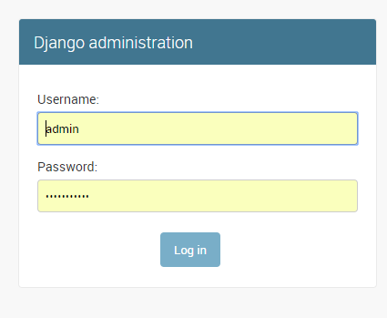
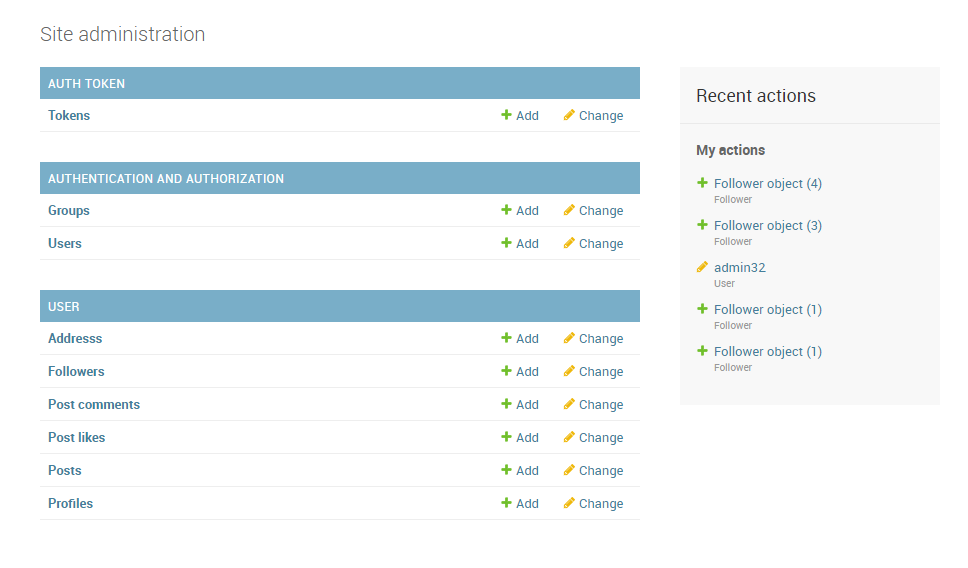
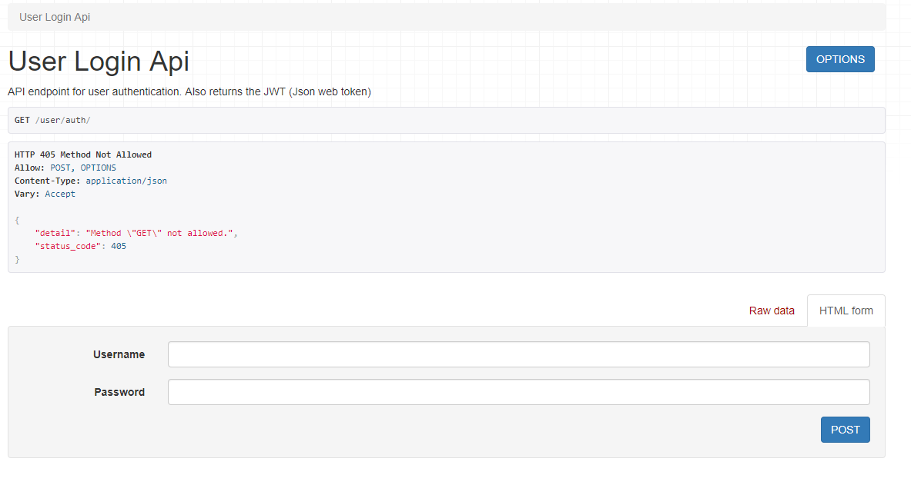
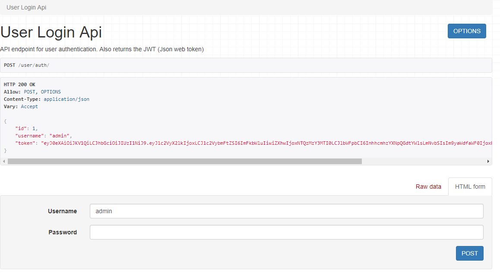

# Python Django Restfull API

A restfull API for the react-blog project based on Django-Restfull Framework

### Prerequisites - installing

You have to install Python 3.6+ and Django Framework
```
pip install mysql
pip install Pillow
pip install djangorestframework
pip install markdown
pip install django-filter
```

## Versioning

We use git for versioning.

## Examples
    

## Authors

* ** Harrys Asimakopoulos ** - *Initial work* - (https://github.com/HarrysAsi/)

